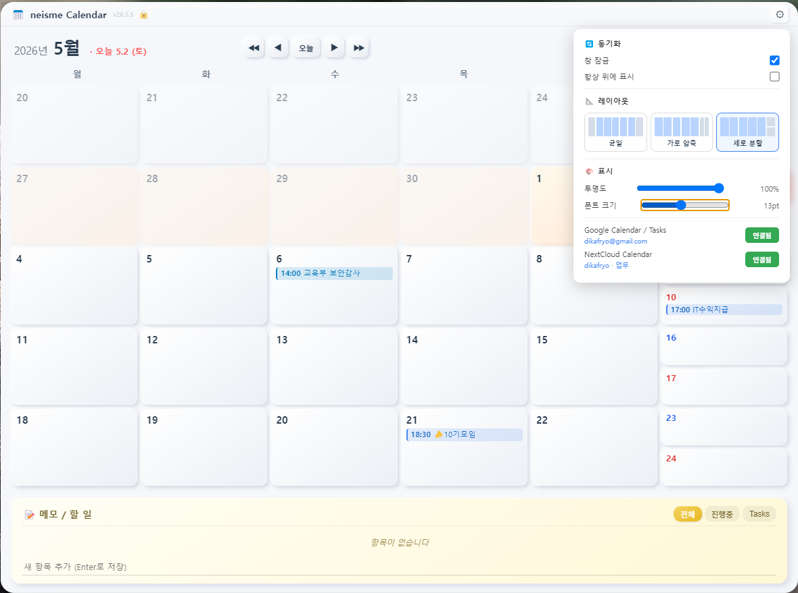

# 📅 neisme Calendar

> 바탕화면에 띄워놓는 반투명 데스크톱 캘린더 위젯
> Google Calendar · Google Tasks · NextCloud 다중 캘린더 양방향 동기화

[](https://github.com/dikafryo/neisme-Calendar/actions/workflows/build-mac.yml)
[](https://github.com/dikafryo/neisme-Calendar/actions/workflows/build-win.yml)
[](https://opensource.org/licenses/MIT)
[](https://www.electronjs.org/)


---

## ✨ 주요 기능

### 🗓 5주 그리드 캘린더
- 항상 5주(35일) 표시 — 위로 1주, 아래로 3주
- **3가지 레이아웃**: 균일 / 가로 압축 / 세로 분할
- 마우스 휠로 주 단위 이동 (250ms throttle)
- 이전/다음 주, 이전/다음 달, 오늘 버튼

### 🔄 다중 클라우드 동기화
- **Google Calendar** — 여러 캘린더 동시 동기화 (개인/업무 분리 가능)
- **Google Tasks** — 메모/할 일 양방향 sync
- **NextCloud** (CalDAV) — 자체 호스팅 서버, 여러 캘린더 동시 동기화
- **다중 캘린더 선택**: 동기화할 캘린더들 체크박스로 선택, ⭐ 별로 기본 캘린더 지정
- **🎨 캘린더별 색상 커스터마이징**: 캘린더 선택 모달에서 색상 점 클릭 → 원하는 색으로 변경 (↺ 버튼으로 원래 색 복원)
- **캘린더 이동 시 자동 동기화**: 화면에 보이는 범위가 동기화 안 됐으면 백그라운드로 자동 fetch
- **앱 재시작 후 캐시 복원**: 이전에 봤던 범위 그대로 즉시 표시

### 🔔 알람
- 5분 / 30분 / 1일 전 알람 (시간 있는 일정만)
- OS 네이티브 알림 (Windows / macOS)
- 24시간 윈도우 자동 스케줄링 (10년치 데이터도 가뿐)

### 🎨 위젯 모드
- **반투명 창** (20%~100%) — 바탕화면에 자연스럽게 어우러짐
- **항상 위에 표시** — 다른 창에 가려지지 않음
- **창 잠금** — 실수로 이동/리사이즈 방지
- 폰트 크기 조절 (9pt~18pt)
- 시스템 트레이 상주 — 닫아도 백그라운드 유지

### 📝 메모 / 할 일 패널
- 캘린더 아래 통합 패널
- Google Tasks와 자동 양방향 sync
- 인라인 편집, 체크박스, 필터 (전체/진행중/Google만)

---

## 📥 다운로드

[**최신 릴리즈**](https://github.com/dikafryo/neisme-Calendar/releases/latest) 페이지에서 다운로드:

| OS | 파일 | 비고 |
|----|------|------|
| **Windows** | `neisme Calendar Setup x.x.x.exe` | NSIS 설치 마법사 |
| **macOS** (Universal) | `neisme Calendar Setup x.x.x.dmg` | Intel + Apple Silicon |

> ⚠️ **macOS 첫 실행**: "확인되지 않은 개발자" 경고가 뜨면 → **시스템 설정 → 개인정보 보호 및 보안 → "그래도 열기"** 한 번 클릭하면 됨. (코드 사인이 안 돼있어서)

---

## 🚀 사용법

### 첫 실행
1. 설치 후 실행하면 바탕화면에 반투명 캘린더가 뜸
2. 우측 상단 **⚙ 설정** 버튼으로 패널 열기
3. **레이아웃 / 투명도 / 폰트 크기** 조정

### Google Calendar 연동
1. 설정 → **Google Calendar / Tasks** 옆 **연결** 버튼
2. 브라우저에서 Google 로그인 → 권한 승인
3. **자동으로 캘린더 선택 모달** 열림 → 동기화할 캘린더들 체크 + ⭐로 기본 캘린더 지정
4. (선택) 각 캘린더 색상 점을 클릭해 원하는 색으로 변경
5. **저장** → 자동 동기화 시작

> 💡 권한이 끊기거나 캘린더 목록 조회가 실패해도 모달은 정상적으로 열려서 **연결 해제** 후 재연결 가능 (v26.5.6+)

### NextCloud 연동
1. 설정 → **NextCloud Calendar** 옆 **연결** 버튼
2. 서버 주소 (예: `https://cloud.example.com`)
3. 사용자 ID + **앱 비밀번호** 입력
   > 💡 [NextCloud → 설정 → 보안 → 기기 및 세션 → "새 앱 비밀번호 만들기"]에서 발급
4. 캘린더 멀티셀렉 (체크박스 + 별 + **🎨 색상 변경**)
5. **완료** → 자동 동기화 시작

### 일정 추가
- **빈 셀 더블클릭** → 일정 추가 모달
- 제목, 날짜, 시간, 알람, **저장 위치 선택** (로컬 / Google / NextCloud)
- Google/NextCloud 선택 시 → **하위 드롭다운에서 어느 캘린더로 보낼지 선택**
- 시간 있는 일정만 알람 가능

### 동기화
- **자동**: 5분마다 백그라운드
- **수동**: 설정의 🔄 동기화 클릭 또는 트레이 우클릭 메뉴
- **자동 범위 확장**: 캘린더를 동기화 안 된 달로 이동하면 자동 fetch (헤더에 ⟳ 표시)

### 키보드 / 마우스
| 동작 | 결과 |
|------|------|
| 빈 셀 더블클릭 | 새 일정 |
| 셀 1번 클릭 | 일정 팝오버 |
| 마우스 휠 (캘린더 위) | 주 단위 이동 |
| 타이틀바 우클릭 | 컨텍스트 메뉴 (잠금/동기화/항상위/종료) |
| F12 / Ctrl+Shift+I | 개발자 도구 |

---

## 🏗 빌드 & 개발

### 요구사항
- **Node.js 22+**
- **Git**

### 로컬 실행 (개발)

```bash
git clone https://github.com/dikafryo/neisme-Calendar.git
cd neisme-Calendar
npm install
npm start          # 또는 npm run dev (DevTools 자동 열림)
```

### Google API 키 설정 (Google 연동 사용 시)

1. [Google Cloud Console](https://console.cloud.google.com/) → 프로젝트 생성
2. **APIs & Services → Library**에서 활성화:
   - Google Calendar API
   - Google Tasks API
3. **OAuth consent screen** → External, 본인 이메일을 Test user에 추가
4. **Credentials → Create credentials → OAuth client ID** → **Desktop app**
5. 발급받은 client_id / client_secret로 프로젝트 루트에 `google-config.json`:

```json
{
  "client_id": "xxxxxxxxxxxx.apps.googleusercontent.com",
  "client_secret": "GOCSPX-xxxxxxxxxxxxxxx"
}
```

> ⚠️ `google-config.json`은 `.gitignore`에 들어있으니 절대 commit하지 마세요. NextCloud는 별도 설정 필요 없음 (앱 안에서 직접 입력).

### 빌드

```bash
# Windows .exe
npm run build:win

# macOS .dmg (Universal — Intel + Apple Silicon)
npm run build:mac-universal

# macOS Apple Silicon 전용 (작음)
npm run build:mac-arm

# macOS Intel 전용
npm run build:mac-intel
```

빌드 결과는 `dist/` 폴더에 생성됨.

### CI/CD (GitHub Actions)

레포에는 두 개의 워크플로가 있음:

- `.github/workflows/build-mac.yml` — macOS 빌드
- `.github/workflows/build-win.yml` — Windows 빌드

**자동 트리거**:
- `v*` 형태 태그 push 시 → 자동 빌드 + GitHub Releases 자동 첨부
- Actions 탭에서 **Run workflow** 수동 실행 가능

**버전 릴리즈 흐름**:
```bash
# package.json의 version 업데이트 후
git tag v26.5.6
git push origin v26.5.6
# → mac/win 동시 빌드 → Releases 페이지에 자동 첨부
```

**GitHub Secrets 설정**:
- 레포 → Settings → Secrets and variables → Actions
- `GOOGLE_CONFIG_JSON` — `google-config.json` 내용 통째로 (선택사항, 없으면 더미로 빌드)

---

## 📁 프로젝트 구조

```
neisme-Calendar/
├── main.js                         # Electron 메인 프로세스 (창/트레이/IPC)
├── preload.js                      # contextBridge — 렌더러에 안전한 API 노출
├── package.json
├── google-config.json              # ⚠️ .gitignore (개인 OAuth 키)
│
├── renderer/
│   ├── index.html                  # 위젯 UI 마크업
│   ├── app.js                      # 렌더러 로직 (캘린더/모달/이벤트)
│   └── styles.css                  # 반투명 위젯 스타일
│
├── sync/
│   ├── google-auth.js              # Google OAuth + 캘린더 선택 관리
│   ├── google-calendar.js          # Calendar 양방향 sync (다중 캘린더, syncToken 증분)
│   ├── google-tasks.js             # Tasks 양방향 sync
│   ├── nextcloud-auth.js           # NextCloud 자격증명 + 캘린더 선택
│   └── nextcloud-calendar.js       # CalDAV sync (다중 캘린더, ETag 증분)
│
├── assets/
│   ├── icon.ico                    # Windows 아이콘
│   ├── icon.png                    # Linux 아이콘
│   ├── icon.icns                   # macOS 앱 아이콘 (Dock)
│   ├── iconTemplate.png            # macOS 트레이 (16x16, 검정 단색)
│   ├── iconTemplate@2x.png         # macOS 트레이 레티나 (32x32)
│   └── entitlements.mac.plist      # macOS 진입권한
│
└── .github/workflows/
    ├── build-mac.yml
    └── build-win.yml
```

---

## 🔧 기술 스택

- **[Electron](https://www.electronjs.org/)** 33 — 크로스플랫폼 데스크톱 앱
- **[electron-builder](https://www.electron.build/)** — 설치 파일 패키징
- **[electron-store](https://github.com/sindresorhus/electron-store)** — 설정/토큰 암호화 저장
- **[googleapis](https://github.com/googleapis/google-api-nodejs-client)** — Google Calendar/Tasks API
- **[tsdav](https://github.com/natelindev/tsdav)** — NextCloud CalDAV 클라이언트
- **[ical.js](https://github.com/kewisch/ical.js)** — iCalendar 파싱

---

## 🗺 로드맵

### v26.x (현재)
- ✅ Google Calendar 다중 캘린더 sync
- ✅ NextCloud 다중 캘린더 sync
- ✅ Google Tasks sync
- ✅ 자동 범위 확장 동기화
- ✅ macOS 지원
- ✅ 캘린더별 색상 커스터마이징 (v26.5.6)
- ✅ 권한 끊김 시 연결 해제 fallback (v26.5.6)

### 향후
- [ ] 반복 일정 (RRULE) 완전 지원
- [ ] 드래그 앤 드롭으로 일정 이동
- [ ] 다국어 (영어, 일본어)
- [ ] 코드 사인 + macOS 노타라이즈

---

## 🛡 개인정보 처리

- **모든 데이터는 로컬 저장**: 일정/메모/설정 모두 `%APPDATA%\neisme-calendar\` (Windows) 또는 `~/Library/Application Support/neisme-calendar/` (macOS)에만 저장
- **OAuth 토큰 암호화**: electron-store의 내장 AES 암호화
- **NextCloud 비밀번호**: 동일하게 로컬 암호화 저장 (앱 비밀번호 권장)
- **외부 서버로 전송하는 데이터 없음**: Google/NextCloud 외 어떤 서버와도 통신 안 함
- **분석/추적 도구 없음**

---

## 🤝 기여

이슈와 PR 환영합니다.

```bash
# 새 기능 개발
git checkout -b feature/awesome-feature
git commit -m "Add awesome feature"
git push origin feature/awesome-feature
# → GitHub에서 Pull Request
```

---

## 📜 라이선스

[MIT License](LICENSE) © 디카프료 ([neis.me](https://neis.me))

---

## 💬 지원 / 문의

- 🐛 [이슈 등록](https://github.com/dikafryo/neisme-Calendar/issues)
- 🌐 [neis.me](https://neis.me)
- ✉️ dikafryo@gmail.com

---

<p align="center">
  Made with ❤️ in Korea by <a href="https://neis.me">디카프료</a>
</p>
